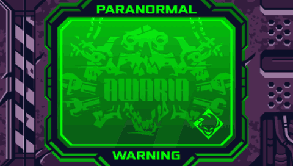

<p align="center">
  
  <br>
  <sub>Chapter 1 from start to REPAIR COMPLETE, 2x speed (recorded from the PSP build in PPSSPP)</sub>
</p>

[](https://github.com/surelynotvain/awaria-psp/releases/latest)
[](https://github.com/surelynotvain/awaria-psp/releases/latest)

# Awaria PSP

An unofficial fan-made demake of **Awaria** by **vanripper** for the **PlayStation Portable**, written in C. The whole game is playable: all 13 chapters, the final boss, the cutscenes and the credits.

> [!NOTE]
> **Honest note:** this port is quite a rushed asset swap and simple logic swap from my [Helltaker PSP demake](https://github.com/surelynotvain/helltaker-psp). It runs on the same engine (now called **Vain's C Portable Engine**), with Awaria's art, sound, text and game logic swapped in. Expect some rough edges, and please report them.

## Download

Get the latest version from the [Releases page](https://github.com/surelynotvain/awaria-psp/releases/latest):

| File | What it is |
|---|---|
| `Awaria-PSP.zip` | The game (copy the `PSP` folder inside to your memory stick) |
| `LANG-Polski.PAK`, `LANG-Espanol.PAK`, `LANG-Francais.PAK` | Optional translations |
| `Awaria-PSP-LangKit.zip` | Tools for making your own translation |

The older [demo](https://github.com/surelynotvain/awaria-psp/releases/tag/v0.2-demo) with Chapters 1 and 2 is still available.

## Installation

1. Unzip `Awaria-PSP.zip`
2. Copy the `PSP` folder to the root of your memory stick. It adds this folder:

   ```text
   PSP/GAME/Awaria/
     EBOOT.PBP
     AW.PAK
     MUSIC.PAK
   ```

3. Start **Awaria** from the XMB (Game > Memory Stick)

You need a PSP with custom firmware (for example ARK-4). Your save (`SETTINGS.BIN`) is written to the same folder: keep it when you update. The full game and the demo have separate folders and saves.

## Controls

| Button | Action |
|---|---|
| D-pad / analog stick | Move |
| Cross | Interact, confirm |
| Square / R | Dash |
| Start | Pause |

## Compatibility

| Model | Status |
|---|---|
| PSP-2000 / 3000 / Street | Supported (playtested on a PSP-3000) |
| PSP Go | Supported |
| PSP-1000 | **Not supported yet.** The final chapter needs more memory than the PSP-1000 has. A later update will make it fit |
| PPSSPP | Works |

**PSP-1000 owners:** the [demo](https://github.com/surelynotvain/awaria-psp/releases/tag/v0.2-demo) should run on your model. Please try it and [open an issue](https://github.com/surelynotvain/awaria-psp/issues) to say how it went.

## Troubleshooting

**The game shows a message instead of starting (1.0.1 and newer), or a plain red screen (1.0 and the demo).** One of the game files is missing, was not copied completely, or comes from a different download. Since 1.0.1 the message says which one and how big the files should be. To fix it:

1. Delete `PSP/GAME/Awaria` from the memory stick
2. Unzip `Awaria-PSP.zip` again and copy the whole `PSP` folder over (`EBOOT.PBP`, `AW.PAK` and `MUSIC.PAK` must come from the same download)
3. Check that the memory stick has enough free space (about 170 MB) and that the copy finished before you remove the stick

Still stuck? [Open an issue](https://github.com/surelynotvain/awaria-psp/issues) with a photo of the message.

## Languages

English is built in. These translations are ready to use:

| Language | Translator | File |
|---|---|---|
| Polish | **EnderSpulka** | `LANG-Polski.PAK` |
| Spanish | **mod3us** ([original](https://mod3us.itch.io/awaria-es)) | `LANG-Espanol.PAK` |
| French | **Supershadow30** ([original](https://steamcommunity.com/sharedfiles/filedetails/?id=3394046869)) | `LANG-Francais.PAK` |

To install one, download it from the release, rename it to `LANG.PAK` and copy it into `PSP/GAME/Awaria/` next to `EBOOT.PBP`. The main menu then has **Settings > Language** to switch between the translation and English (the choice is saved). Only one `LANG.PAK` can be installed at a time. Without it, or if it does not match the game version, the game uses English.

Translations cover the menus, chapter briefings, dialogue and the texts in the game's scenes. Text that is drawn into the original artwork stays as it is.

### Make your own translation

No PSP toolchain needed, only Python 3 with `pip install pillow numpy`:

1. Download `Awaria-PSP-LangKit.zip` from the [Releases page](https://github.com/surelynotvain/awaria-psp/releases/latest)
2. Translate the game's text files (the same files as `Awaria/local` in the PC game, one text per line). Existing PC translations work as they are
3. Build it: `python mklang.py MyLanguage --name MyLanguage`
4. Copy the `LANG.PAK` it writes next to `EBOOT.PBP`

Latin alphabets with accents, Greek and Cyrillic work out of the box. Chinese, Japanese and Korean work with an extra font (`--font some.ttf`). The full guide is [translation/TRANSLATING.md](translation/TRANSLATING.md), and the translated text files of the ready languages are in [translations/](translations/).

Made a translation (German is still missing)? [Open an issue](https://github.com/surelynotvain/awaria-psp/issues) and share it.

## XMB


The XMB entry has its own artwork, an animated icon (a Chapter 1 run) and background music.

## Source code

The engine source is in [engine/](engine/): **Vain's C Portable Engine 2**, the base shared with Helltaker PSP plus a small Unity-style runtime (scenes, animator, physics, pathfinding), and the Awaria game code on top of it. Game assets, converted game data and the converter are not included.

## Reporting bugs

Please [open an issue](https://github.com/surelynotvain/awaria-psp/issues) with:

- your PSP model and custom firmware
- the chapter and what you were doing
- what happened (a photo or video helps)

## Credits

- **Awaria** was created by **vanripper**. It is free on [Steam](https://store.steampowered.com/app/3274300/), please support the original.
- PSP port by **surelynotvain**, built on Vain's C Portable Engine (shared with [Helltaker PSP](https://github.com/surelynotvain/helltaker-psp)).
- Translations by **EnderSpulka** (Polish), **mod3us** (Spanish) and **Supershadow30** (French). Thank you!

## Disclaimer

This is an unofficial fan project, not affiliated with or endorsed by vanripper. All Awaria names, characters, artwork, music and related assets belong to their rights holders. The port is provided as is, without warranty.
